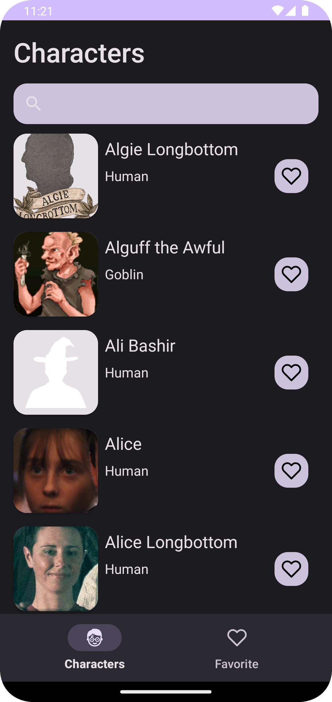
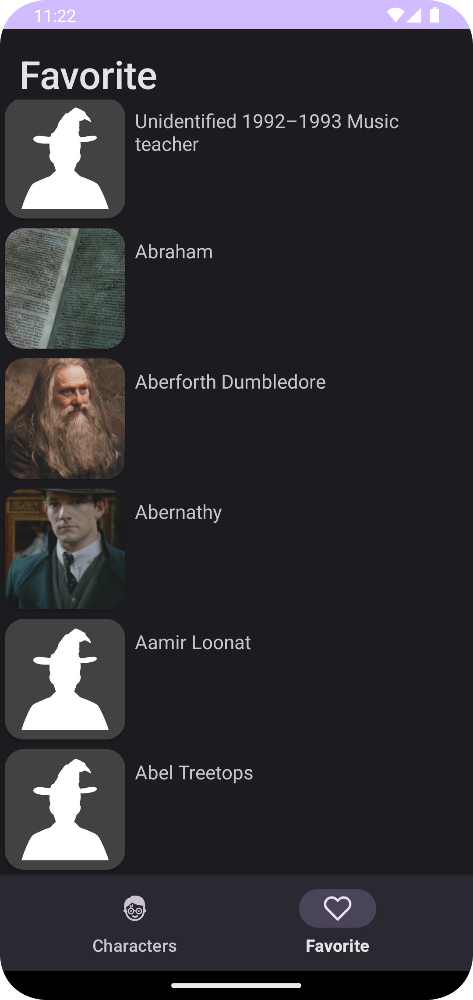
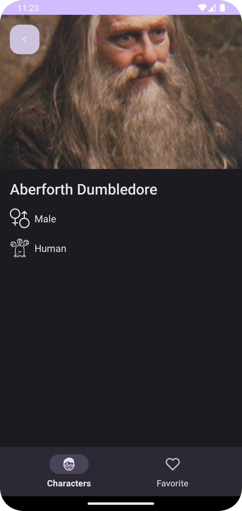
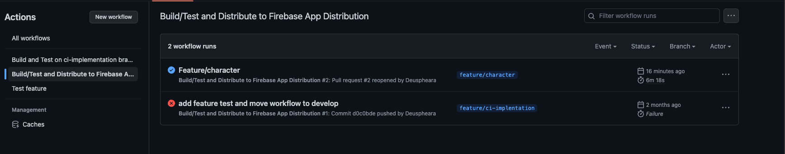
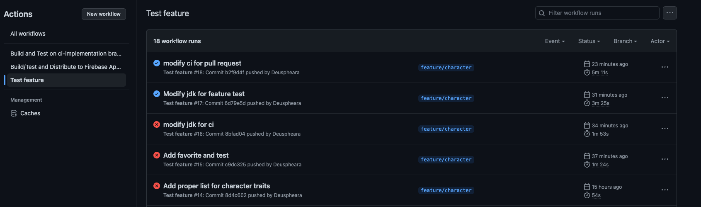
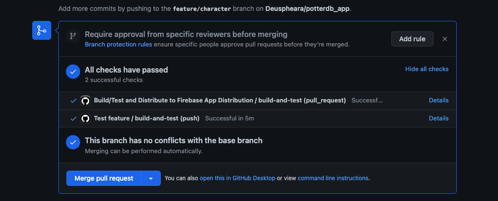

The application shows you the characters of Harry Potter and their information. You can add them to your favorites and view them in the favorites tab.

## Screens

The different screens of the application are:

| Character Screen | Favorite Screen | Character Detail |
|:----------------:|:---------------:|:----------------:|
|  |  |  |

## Workflow Github Actions

Build and test the application, and publish to Firebase App distribution.

Test for feature branch.

Pull request.

